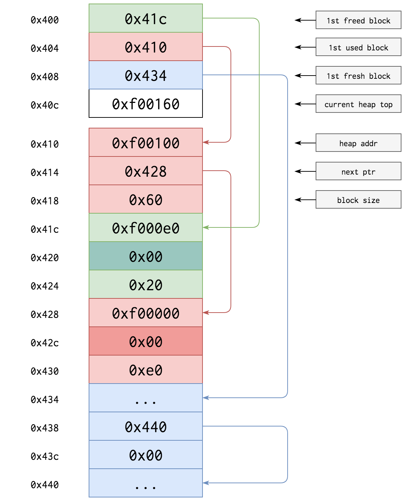

# thi.ng/tinyalloc

Tiny replacement for `malloc` / `free` in unmanaged, linear memory situations, e.g. [WASM](http://webassembly.org) and [embedded devices](https://github.com/thi-ng/ws-ldn-12).

## Features

- written in standalone C11, no dependencies, C runtime or syscalls used
- configurable address region (and max. block count) for heap space
- configurable pointer alignment in heap space
- optional compaction of consecutive free blocks
- optional block splitting during alloc (if re-using larger free'd blocks)
- tiny, the WASM binary is 1.5KB

## Details

**tinyalloc** maintains 3 linked lists: fresh blocks, used blocks, free blocks. All lists are stored in the same fixed sized array so the memory overhead can be controlled at compile time via the [configuration vars](#configuration) listed below. During initialization all blocks are added to the list of available blocks.



### Allocation

When a new chunk of memory is requested, all previously freed blocks are checked for potential re-use. If a block is found, is larger than the requested size and the size difference is greater than the configured threshold (`TA_SPLIT_THRESHOLD`), then the block is first split, the chunks added to the used & free lists respectively and the pointer to the first chunk returned to the user. If no blocks in the free list qualify, a new block is allocated at the current heap top address, moved from the "fresh" to the "used" block list and the pointer returned to the caller.

Note: All returned pointers are aligned to `TA_ALIGN` word boundaries. Same goes for allocated block sizes.

### Freeing & compaction

The list of freed blocks is sorted by block start address. When a block is being freed, **tinyalloc** uses insertion sort to add the block at the right list position and then runs a compaction procedure, merging blocks as long as they form consecutive chunks of memory (with no gaps inbetween them). The resulting obsolete blocks are re-added to the list of available blocks.

## API

### ta\_init()

Initializes the control datastructure. MUST be called prior to any other **tinyalloc** function.

### void* ta\_alloc(size\_t num)

Like standard `malloc`, returns aligned pointer to address in heap space, or `NULL` if allocation failed.

### void* ta\_calloc(size\_t num, size\_t t)

Like standard `calloc`, returns aligned pointer to zeroed memory in heap space, or `NULL` if allocation failed.

### bool ta\_free(void *ptr)

Like `free`, but returns boolean result (true, if freeing succeeded). By default, any consecutive memory blocks are being merged during the freeing operation.

### bool ta\_check()

Structural validation. Returns `true` if internal heap structure is ok.

## Building

### Configuration

| Define | Default | Comment |
|--------|---------|---------|
| `TA_ALIGN` | 8 | Word size for pointer alignment |
| `TA_BASE` | 0x400 | Address of **tinyalloc** control data structure |
| `TA_DEBUG` | undefined | Trace debug information |
| `TA_HEAP_START` | 0x1010 | Heap space start address |
| `TA_HEAP_LIMIT` | 0xffffff | Heap space end address |
| `TA_HEAP_BLOCKS` | 256 | Max. number of memory chunks |
| `TA_SPLIT_THRESH` | 16 | Size threshold for splitting chunks |

On a 32bit system, the default configuration causes an overhead of 3088 bytes in RAM, but can be reduced if fewer memory blocks are needed.

**Notes:**

- `TA_ALIGN` is assumed to be >= native word size
- `TA_HEAP_START` is assumed to be properly aligned

If building in debug mode (if `TA_DEBUG` symbol is defined), two externally defined functions are required:

- `print_s(char *)` - to print a single string
- `print_i(size_t)` - to print a single unsigned int

### Building for WASM

(Requires [emscripten](http://emscripten.org))

```sh
emcc -Os -s WASM=1 -s SIDE_MODULE=1 -o tinyalloc.wasm tinyalloc.c
```

#### Disassemble to WAST

(Requires [WABT](https://github.com/WebAssembly/wabt))

```sh
wasm2wast --generate-names tinyalloc.wasm > tinyalloc.wast
```
